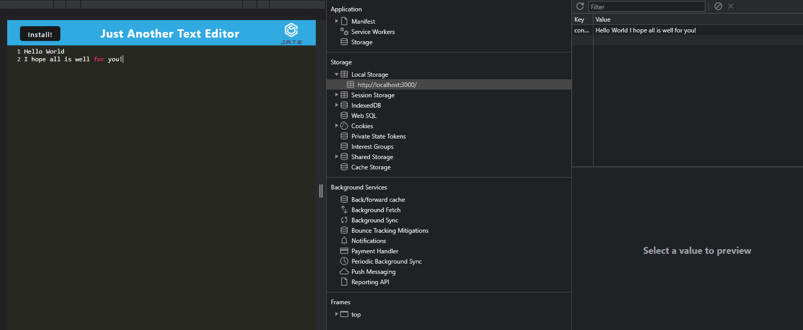
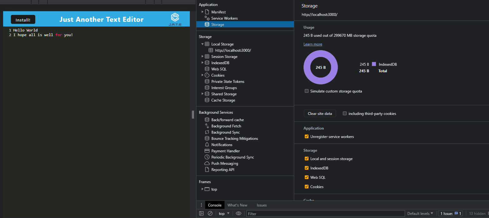

# JATE - Just Another Text Editor

This project is a simple Progressive Web App (PWA) text editor called 'JATE' (Just Another Text Editor) that allows users to edit and save text in the browser.

## Table of Contents

- [Features](#features)
- [Installation](#installation)
- [Usage](#usage)
- [Technologies](#technologies)
- [Contributing](#contributing)
- [License](#license)

## User Story

```md
AS A developer
I WANT to create notes or code snippets with or without an internet connection
SO THAT I can reliably retrieve them for later use
```

## Acceptance Criteria

```md
GIVEN a text editor web application
WHEN I open my application in my editor
THEN I should see a client server folder structure
WHEN I run `npm run start` from the root directory
THEN I find that my application should start up the backend and serve the client
WHEN I run the text editor application from my terminal
THEN I find that my JavaScript files have been bundled using webpack
WHEN I run my webpack plugins
THEN I find that I have a generated HTML file, service worker, and a manifest file
WHEN I use next-gen JavaScript in my application
THEN I find that the text editor still functions in the browser without errors
WHEN I open the text editor
THEN I find that IndexedDB has immediately created a database storage
WHEN I enter content and subsequently click off of the DOM window
THEN I find that the content in the text editor has been saved with IndexedDB
WHEN I reopen the text editor after closing it
THEN I find that the content in the text editor has been retrieved from our IndexedDB
WHEN I click on the Install button
THEN I download my web application as an icon on my desktop
WHEN I load my web application
THEN I should have a registered service worker using workbox
WHEN I register a service worker
THEN I should have my static assets pre cached upon loading along with subsequent pages and static assets
WHEN I deploy to Heroku
THEN I should have proper build scripts for a webpack application
```
## Mock Up



## Features

Edit and write code with syntax highlighting, line numbering and auto-indentation.
Auto-save feature to keep your text safe.
Data persistence using IndexedDB for offline use.
Responsive UI that works on all screen sizes.
PWA: Installable and works offline.

## Installation

To install the project, follow these steps:

Clone the repository: git clone https://github.com/<username>/jate.git
Install the dependencies: npm install
Start the development server: npm run start
Visit http://localhost:8000 in your browser.

## Usage

Once the app is installed and running:

Edit the text/code in the editor.
Your changes will be auto-saved and remain even after a page refresh.
When offline, your data will be stored locally and synced when online.

## Technologies

This project uses the following technologies:

- Workbox
- CodeMirror
- IndexedDB
- Webpack

## Contributing

Contributions are welcome. Please fork the repository and create a pull request with your changes.

## License

This project is licensed under the MIT License. See LICENSE for more information.
